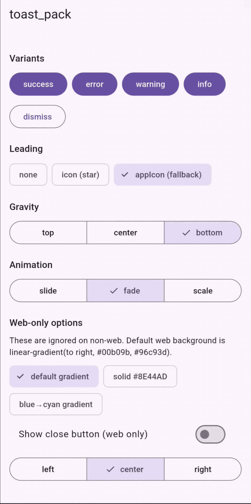

# toast_pack

A simple Flutter toast package built with `Overlay`.

Use it when you need small success, error, warning, or info messages without adding a heavy dependency.



## Features

- Success, error, warning, and info toasts
- Top, center, and bottom placement
- Slide, fade, and scale animations
- Optional leading icon, asset image, or app icon
- One toast visible at a time
- Configurable replacement behavior
- Web-only close button, horizontal position, and gradient background
- Native app icon lookup on Android, iOS, and macOS

## Install

```yaml
dependencies:
  toast_pack: ^0.1.1
```

Then import it:

```dart
import 'package:toast_pack/toast_pack.dart';
```

## Quick Start

Call `ToastPack.init()` once in `main()`. It is optional, but useful when you want to set package-wide defaults.

```dart
import 'package:flutter/material.dart';
import 'package:toast_pack/toast_pack.dart';

void main() {
  ToastPack.init();
  runApp(const MyApp());
}

class MyScreen extends StatelessWidget {
  const MyScreen({super.key});

  @override
  Widget build(BuildContext context) {
    return ElevatedButton(
      onPressed: () {
        ToastPack.success(context, 'Item added to cart');
      },
      child: const Text('Add to cart'),
    );
  }
}
```

## Basic Use Cases

### Success toast

Use this after a completed action.

```dart
ToastPack.success(context, 'Profile saved');
```

### Error toast

Use this when something fails.

```dart
ToastPack.error(context, 'Payment failed. Please try again');
```

### Warning toast

Use this when the user should double-check something.

```dart
ToastPack.warning(context, 'Only 2 items left in stock');
```

### Info toast

Use this for neutral messages.

```dart
ToastPack.info(context, 'Your order is being prepared');
```

### Dismiss current toast

Use this when you want to close the active toast yourself.

```dart
ToastPack.dismiss();
```

## Position

Use `gravity` to control vertical placement.

```dart
ToastPack.success(
  context,
  'Added to wishlist',
  gravity: ToastGravity.top,
);

ToastPack.info(
  context,
  'Syncing cart',
  gravity: ToastGravity.center,
);

ToastPack.error(
  context,
  'Could not load products',
  gravity: ToastGravity.bottom,
);
```

Available values:

```dart
ToastGravity.top
ToastGravity.center
ToastGravity.bottom
```

## Animations

Use `animation` to choose how the toast appears and disappears.

```dart
ToastPack.success(
  context,
  'Order placed',
  animation: ToastAnimation.slide,
);

ToastPack.info(
  context,
  'Coupon applied',
  animation: ToastAnimation.fade,
);

ToastPack.warning(
  context,
  'Cart updated',
  animation: ToastAnimation.scale,
);
```

You can also change the speed and curve.

```dart
ToastPack.success(
  context,
  'Saved',
  animationDuration: const Duration(milliseconds: 350),
  curve: Curves.easeOutBack,
);
```

## Duration

By default, a toast stays visible for 2 seconds.

```dart
ToastPack.info(
  context,
  'Downloading invoice',
  duration: const Duration(seconds: 4),
);
```

## Colors

Each variant has a default color. You can override it when needed.

```dart
ToastPack.success(
  context,
  'Custom brand toast',
  backgroundColor: const Color(0xFF111827),
  textColor: Colors.white,
);
```

Default colors:

| Variant | Background | Text | Fallback icon |
| --- | --- | --- | --- |
| `success` | `#4CAF50` | white | `Icons.check_circle` |
| `error` | `#F44336` | white | `Icons.error` |
| `warning` | `#FFC107` | black | `Icons.warning` |
| `info` | `#2196F3` | white | `Icons.info` |

## Text Style

Use `fontSize` and `fontFamily` for simple text styling.

```dart
ToastPack.info(
  context,
  'Welcome back',
  fontSize: 16,
  fontFamily: 'Inter',
);
```

If your app uses responsive font helpers, pass the calculated value with a clear `base`, `min`, and `max`.

```dart
ToastPack.info(
  context,
  'Welcome back',
  fontSize: context.scaledFont(base: 14, min: 12, max: 18),
);
```

Or:

```dart
ToastPack.info(
  context,
  'Welcome back',
  fontSize: AppTheme.scaledFontSize(base: 14, min: 12, max: 18),
);
```

## Leading Visual

By default, no leading visual is shown.

### No leading visual

```dart
ToastPack.info(
  context,
  'Address updated',
  leading: const ToastLeading.none(),
);
```

### Material icon

```dart
ToastPack.success(
  context,
  'Added to favorites',
  leading: const ToastLeading.icon(Icons.favorite),
);
```

You can customize icon color and size.

```dart
ToastPack.info(
  context,
  'New message',
  leading: const ToastLeading.icon(
    Icons.chat_bubble,
    color: Colors.white,
    size: 22,
  ),
);
```

### Asset image

Use this for custom images, logos, or small illustrations.

```dart
ToastPack.success(
  context,
  'Reward unlocked',
  leading: const ToastLeading.image('assets/reward.png'),
);
```

Image leading visuals use percentage-based sizing. By default, the image can
occupy `80%` of the toast height and `20%` of the toast width. In code,
`0.80` means 80%, not 80 pixels.

```dart
ToastPack.success(
  context,
  'Reward unlocked',
  leading: const ToastLeading.image(
    'assets/reward.png',
    heightPercentage: 0.75,
    widthPercentage: 0.18,
  ),
);
```

If the asset cannot load, the toast falls back to the variant icon.

### App icon

Use this when you want the toast to show your app icon.

```dart
ToastPack.info(
  context,
  'Snaptoast is ready',
  leading: const ToastLeading.appIcon(),
);
```

The app icon uses the same percentage sizing defaults as image leading visuals:
`heightPercentage: 0.80` and `widthPercentage: 0.20`.

```dart
ToastPack.info(
  context,
  'Snaptoast is ready',
  leading: const ToastLeading.appIcon(
    heightPercentage: 0.80,
    widthPercentage: 0.20,
  ),
);
```

You can also provide your own app icon asset once during startup.

```dart
void main() {
  ToastPack.init(
    defaultIconAsset: 'assets/app_icon.png',
  );

  runApp(const MyApp());
}
```

Then use:

```dart
ToastPack.info(
  context,
  'Using custom app icon',
  leading: const ToastLeading.appIcon(),
);
```

## Margins

Use `margin` to control spacing from the screen edges.

```dart
ToastPack.success(
  context,
  'Placed near the edge',
  margin: const EdgeInsets.all(24),
);
```

## Replacement Behavior

Only one toast is visible at a time.

By default, a new toast immediately replaces the current toast.

```dart
void main() {
  ToastPack.init(
    replacementMode: ReplacementMode.instantReplace,
  );

  runApp(const MyApp());
}
```

If you want a smoother transition, use `gracefulCrossfade`.

```dart
void main() {
  ToastPack.init(
    replacementMode: ReplacementMode.gracefulCrossfade,
  );

  runApp(const MyApp());
}
```

## Web Use Cases

Web has a few extra options.

### Web close button

```dart
ToastPack.info(
  context,
  'Product added',
  webShowClose: true,
);
```

### Web horizontal position

```dart
ToastPack.success(
  context,
  'Saved',
  webPosition: ToastWebPosition.right,
);
```

Available values:

```dart
ToastWebPosition.left
ToastWebPosition.center
ToastWebPosition.right
```

### Web solid background

```dart
ToastPack.info(
  context,
  'Web toast',
  webBgColor: '#111827',
);
```

### Web gradient background

```dart
ToastPack.success(
  context,
  'Order confirmed',
  webBgColor: 'linear-gradient(to right, #00b09b, #96c93d)',
);
```

Supported `webBgColor` values:

- Hex color: `#RRGGBB`
- Hex color with alpha: `#RRGGBBAA`
- Linear gradient: `linear-gradient(to right, #00b09b, #96c93d)`

Supported gradient directions:

```text
to left
to right
to top
to bottom
to top left
to top right
to bottom left
to bottom right
```

Web-only options are ignored on non-web platforms.

## Platform Notes

### Android

`toast_pack` uses Flutter `Overlay`, so normal toasts work inside your Flutter UI.

`ToastLeading.appIcon()` can read the native Android launcher icon.

Image placeholder:

```md

```

Example:

```dart
ToastPack.success(
  context,
  'Added to cart',
  leading: const ToastLeading.appIcon(),
  gravity: ToastGravity.bottom,
);
```

### iOS

Normal toasts work inside your Flutter UI.

`ToastLeading.appIcon()` can read the iOS app icon from the app bundle.

Image placeholder:

```md

```

Example:

```dart
ToastPack.info(
  context,
  'Order status updated',
  leading: const ToastLeading.appIcon(),
  gravity: ToastGravity.top,
);
```

### macOS

Normal toasts work inside your Flutter UI.

`ToastLeading.appIcon()` can read the macOS application icon.

Image placeholder:

```md

```

Example:

```dart
ToastPack.warning(
  context,
  'Connection is slow',
  leading: const ToastLeading.appIcon(),
  animation: ToastAnimation.fade,
);
```

### Web

Normal toasts work inside your Flutter UI.

Web supports extra styling options like `webShowClose`, `webPosition`, and `webBgColor`.

`ToastLeading.appIcon()` uses `defaultIconAsset` if you set one. Without an asset override, it falls back to the variant icon.

Image placeholder:

```md

```

Example:

```dart
ToastPack.success(
  context,
  'Checkout complete',
  webShowClose: true,
  webPosition: ToastWebPosition.right,
  webBgColor: 'linear-gradient(to right, #2193b0, #6dd5ed)',
);
```

### Windows

Normal toasts work inside your Flutter UI.

`ToastLeading.appIcon()` does not have native Windows icon lookup in this version. Use `defaultIconAsset`, `ToastLeading.image(...)`, or `ToastLeading.icon(...)`.

Image placeholder:

```md

```

Example:

```dart
ToastPack.info(
  context,
  'Desktop toast',
  leading: const ToastLeading.icon(Icons.desktop_windows),
);
```

### Linux

Normal toasts work inside your Flutter UI.

`ToastLeading.appIcon()` does not have native Linux icon lookup in this version. Use `defaultIconAsset`, `ToastLeading.image(...)`, or `ToastLeading.icon(...)`.

Image placeholder:

```md

```

Example:

```dart
ToastPack.info(
  context,
  'Desktop toast',
  leading: const ToastLeading.icon(Icons.desktop_windows),
);
```

## All Parameters

All variant methods support the same parameters.

```dart
ToastPack.success(
  context,
  'Message',
  duration: const Duration(seconds: 2),
  gravity: ToastGravity.bottom,
  backgroundColor: null,
  textColor: null,
  fontSize: 14,
  fontFamily: null,
  leading: const ToastLeading.none(),
  margin: const EdgeInsets.all(16),
  padding: const EdgeInsets.symmetric(horizontal: 20, vertical: 14),
  animation: ToastAnimation.slide,
  animationDuration: const Duration(milliseconds: 250),
  curve: Curves.easeOut,
  webShowClose: false,
  webBgColor: null,
  webPosition: ToastWebPosition.center,
);
```

| Parameter | Type | Default |
| --- | --- | --- |
| `duration` | `Duration` | `Duration(seconds: 2)` |
| `gravity` | `ToastGravity` | `ToastGravity.bottom` |
| `backgroundColor` | `Color?` | variant default |
| `textColor` | `Color?` | variant default |
| `fontSize` | `double` | `14` |
| `fontFamily` | `String?` | ambient text font |
| `leading` | `ToastLeading` | `ToastLeading.none()` |
| `margin` | `EdgeInsets` | `EdgeInsets.all(16)` |
| `padding` | `EdgeInsets` | `EdgeInsets.symmetric(horizontal: 20, vertical: 14)` |
| `animation` | `ToastAnimation` | `ToastAnimation.slide` |
| `animationDuration` | `Duration` | `Duration(milliseconds: 250)` |
| `curve` | `Curve` | `Curves.easeOut` |
| `webShowClose` | `bool` | `false` |
| `webBgColor` | `String?` | default web gradient |
| `webPosition` | `ToastWebPosition` | `ToastWebPosition.center` |

## Full Example

```dart
ToastPack.success(
  context,
  'Item added to cart',
  duration: const Duration(seconds: 3),
  gravity: ToastGravity.bottom,
  backgroundColor: const Color(0xFF111827),
  textColor: Colors.white,
  fontSize: context.scaledFont(base: 14, min: 12, max: 18),
  leading: const ToastLeading.icon(Icons.shopping_cart),
  margin: const EdgeInsets.all(20),
  animation: ToastAnimation.slide,
  animationDuration: const Duration(milliseconds: 300),
  curve: Curves.easeOut,
  webShowClose: true,
  webBgColor: 'linear-gradient(to right, #111827, #2563EB)',
  webPosition: ToastWebPosition.right,
);
```

## Example App

See [`example/`](example/) for a demo app.
